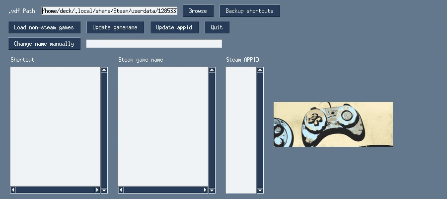

## Steam shortcut editor

### Purpose:
allow you to modify the shortcuts file quickly and set game name to be the appid so you have access to community controls

### usage:

### How to build
/home/deck/anaconda3/bin/python -m PyInstaller app.py --noconfirm  --onefile --name shortcut_editor
